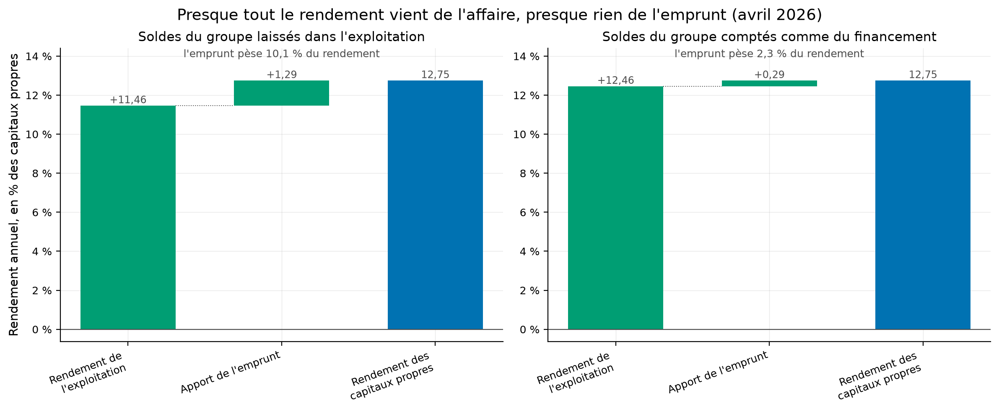
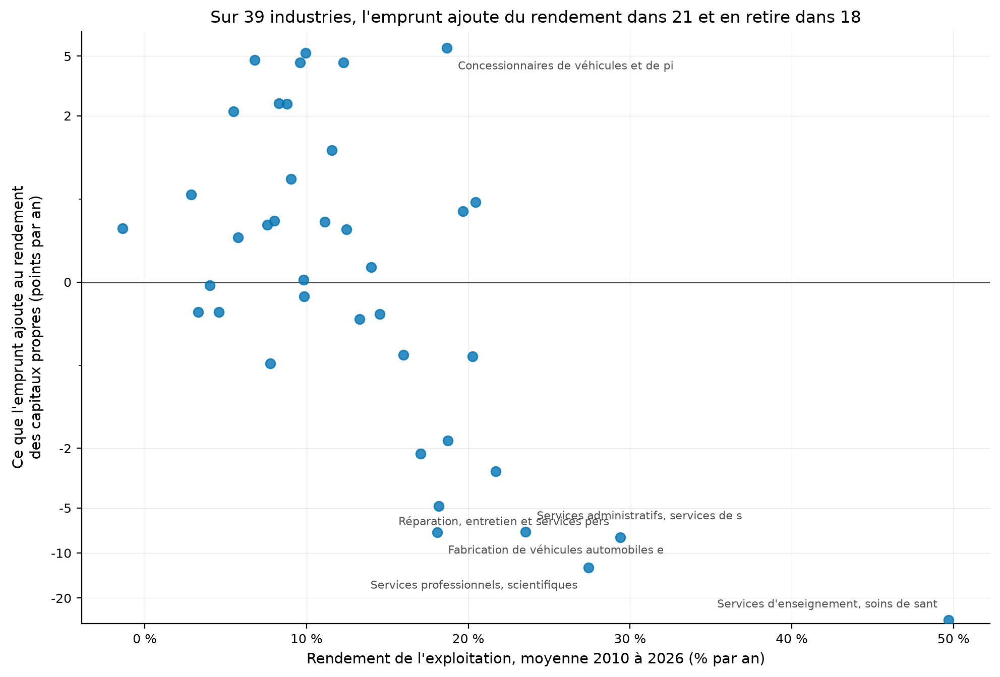
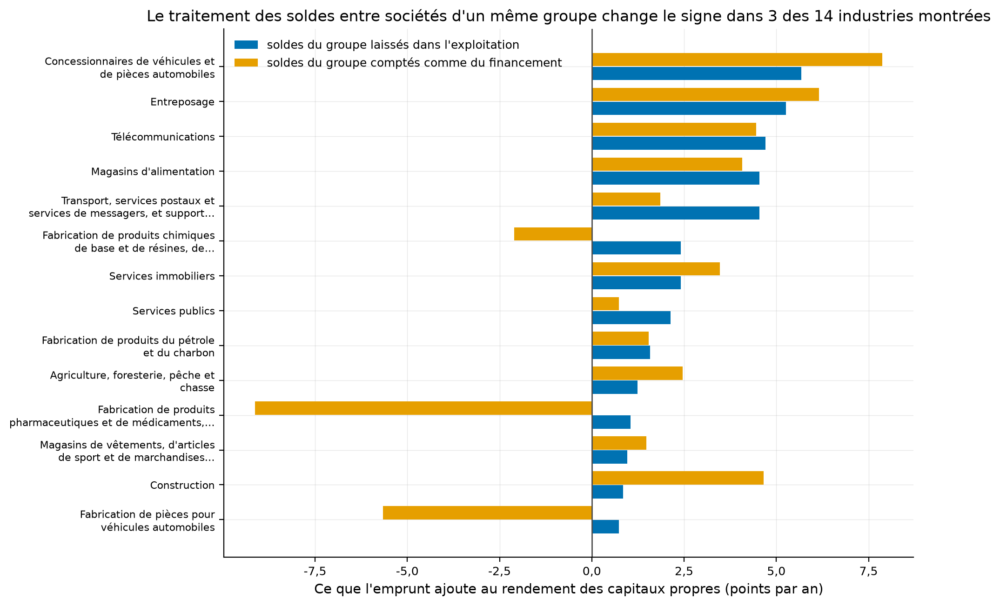
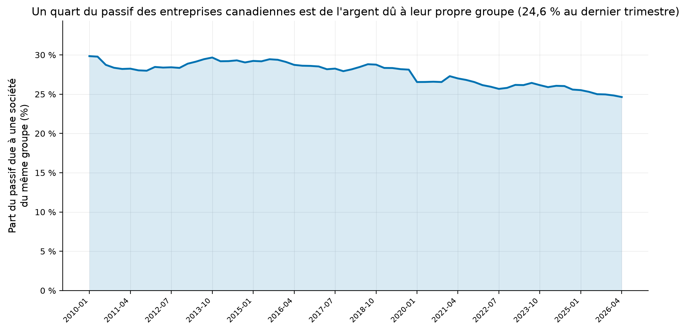

# Les entreprises canadiennes gagnent leur argent en vendant, pas en empruntant

Quand une entreprise rapporte de l'argent à ses propriétaires, deux explications sont possibles. Soit
elle vend bien ce qu'elle fabrique. Soit elle a beaucoup emprunté, et l'argent emprunté lui rapporte
plus qu'il ne lui coûte. Ce n'est pas la même chose : la première explication tient dans la durée, la
seconde se retourne dès que les taux montent. Ce dépôt sépare les deux, sur toutes les entreprises
non financières du Canada.

[](https://github.com/Guilou001/28-etats-financiers-reformules/actions/workflows/ci.yml)


**Résultat en une phrase.** Sur 26 trimestres et 39 industries, l'affaire elle-même rapporte de
**11,5 % à 13,1 %** par an en médiane selon la lecture. L'emprunt n'ajoute que **+0,18 point** en
médiane, ou **−0,88 point** selon la façon de traiter les soldes entre sociétés d'un même groupe, et
la part médiane du rendement qui lui revient va de **+0,26 % à −5,25 %**. Ce sont six médianes prises
sur les 39 industries, et non des bornes : dix-neuf industries font mieux dans chaque lecture.

*Summary in English. A Nissim-Penman reformulation of Statistics Canada's quarterly aggregate
balance sheet and income statement (table 33-10-0225, 327 360 rows, 66 quarters, 40 industries),
separating operating from financing returns. Eight of the items the reformulation adds up are only
published from January 2020, so the calculation covers 26 quarters and 1 040 industry-quarters, and
the other 1 600 are reported as dropped. Operating return runs from 11.5 % to 13.1 % a year at the
median, depending on the reading. The median contribution of leverage is +0.18 point in one reading
and −0.88 point in the other, and the median share of return on equity it carries runs from +0.26 %
to −5.25 %. These are medians over the 39 industries and not bounds: nineteen industries do better
in each reading. Both accounting
identities hold on all 1 040 rows: 1 million dollars, one unit of the last digit the table publishes,
and 0.008 points of annual return on the reformulation identity.*

## 1. La question posée

**En mots simples.** Une entreprise qui rapporte 12 % par an à ses actionnaires : d'où viennent ces
12 % ? Le bilan publié ne le dit pas, parce qu'il range les actifs par nature et non par usage. La
trésorerie y côtoie les usines, et la dette bancaire y côtoie les factures à payer aux fournisseurs.

Reformuler, c'est réécrire ce bilan en deux blocs. D'un côté ce qu'il faut pour faire tourner
l'affaire : les stocks, les créances clients, les usines, moins les dettes fournisseurs. De l'autre
l'argent emprunté, moins la trésorerie et les placements.

De là vient une égalité vraie par construction, et non estimée :

> rendement des capitaux propres = rendement de l'affaire + levier × (rendement de l'affaire − coût
> de la dette)

Le levier, le rapport de l'argent emprunté net aux capitaux propres, dit combien de dollars empruntés
portent un dollar d'actionnaire. Il est négatif quand l'entreprise a plus de trésorerie et de
placements que d'emprunts. Quand il est positif, l'égalité dit que l'emprunt n'ajoute de la
rentabilité que si l'affaire rapporte plus que la dette ne coûte, et qu'il en retire sinon. Quand il
est négatif, le signe s'inverse, et la colonne « l'emprunt ajoute » mesure alors le rendement
sacrifié en gardant ces liquidités.

## 2. D'où vient le projet, et ce qu'il apporte

La méthode vient de Doron Nissim et Stephen Penman, qui l'ont posée en 2001 sur des entreprises
américaines cotées. Elle est appliquée société par société. Elle ne l'avait pas été sur le tableau
agrégé officiel canadien.

Trois apports.

- **Une reformulation complète du bilan agrégé canadien**, industrie par industrie et trimestre par
  trimestre, soit 1 040 calculs.
- **Deux lectures des soldes entre sociétés d'un même groupe**, publiées côte à côte parce qu'elles
  changent le signe du verdict pour trois industries sur les quatorze montrées.
- **Deux identités vérifiées à la machine** sur chaque ligne, plutôt qu'un résultat affirmé.

## 3. Un seul tableau public, 327 360 lignes et 40 industries

Le tableau 33-10-0225 de Statistique Canada donne le bilan et le compte de résultat agrégés des
entreprises non financières du pays. Mesuré le 30 août 2026 : **327 360 lignes**, 66 trimestres de
janvier 2010 à avril 2026, 40 industries, 122 postes, 63 536 828 octets une fois décompressé. Licence
ouverte de Statistique Canada, usage et redistribution permis avec attribution ; rien n'est
redistribué ici.

Le calcul ne couvre pas ces 66 trimestres. Huit des postes que la reformulation additionne ne sont
publiés qu'à partir du premier trimestre de 2020. Cinq sont des postes de bilan : les prêts aux
non-affiliées, les prises en pension, les titres de capitaux propres classés en passif, les
participations ne donnant pas le contrôle et les actions privilégiées. Les trois autres sont des
postes de résultat : le produit total d'intérêts, puis l'intérêt reçu et l'intérêt payé sur les
soldes du groupe.

Avant 2020, l'actif d'exploitation net n'est donc pas calculable. Les compter pour zéro rangerait des
montants réels du mauvais côté de la séparation, sans que rien ne le signale. Les lignes sont écartées
et comptées : **1 040 lignes calculées, 1 600 écartées**, colonne `lignes_ecartees` de
`results/identites.csv`. La fenêtre obtenue est **janvier 2020 à avril 2026, soit 26 trimestres**.

Les noms d'industries qui s'affichent ne sont pas traduits : ils sont recopiés de la version
française du même tableau.

## 4. La méthode, pas à pas

1. **Vérifier que le bilan se referme.** L'actif moins le passif moins les capitaux propres doit
   valoir zéro. Mesuré : l'écart maximal sur les 1 040 lignes calculées vaut **1 million de dollars**,
   c'est-à-dire une unité du dernier chiffre publié, le tableau étant exprimé en millions de dollars
   et arrondi à l'unité. Sur les 2 640 lignes du tableau, écartées comprises, il vaut 8 millions.
2. **Ranger chaque poste** selon son usage, financier ou d'exploitation. C'est le seul vrai choix du
   dépôt, et il est écrit en clair dans le code plutôt que caché.
3. **Sortir les participations minoritaires et les actions privilégiées** des capitaux propres : elles
   ne reviennent pas à l'actionnaire ordinaire. Le tableau ne publie ni la part du résultat qui leur
   revient, ni le dividende privilégié, si bien que la sortie n'est faite qu'au bilan. La section 7
   chiffre ce que cela laisse dans le numérateur.
4. **Répartir l'impôt** entre exploitation et financement, au taux effectif de chaque industrie.
5. **Vérifier la seconde identité.** Le rendement calculé directement doit égaler le rendement de
   l'affaire plus l'apport de l'emprunt. Mesuré : l'écart maximal vaut **2 × 10⁻⁵** en fraction de
   rendement trimestriel, soit **0,008 point de rendement annuel**.

## 5. L'affaire fait presque tout le rendement, dans les deux lectures

### 5.1 D'où vient le rendement de l'ensemble des entreprises canadiennes

Au dernier trimestre publié, avril 2026.

| Lecture | L'affaire rapporte | Coût de la dette | Levier | L'emprunt ajoute | Total |
|---|---:|---:|---:|---:|---:|
| Soldes du groupe laissés dans l'exploitation | 11,46 % | 5,64 % | 0,221 | **+1,29 point** | 12,75 % |
| Soldes du groupe comptés comme du financement | 12,46 % | 8,70 % | 0,078 | **+0,29 point** | 12,75 % |

Comment lire ce tableau, en trois constats. Le premier est que la colonne de droite est la même dans
les deux lignes, et c'est normal : le rendement des capitaux propres est un fait comptable, seule sa
décomposition dépend du rangement. Le deuxième est que l'emprunt pèse **10,1 % du rendement** dans la
première lecture et **2,3 %** dans la seconde, donc l'affaire fait presque tout dans les deux cas.
Le troisième est que le coût de la dette de la seconde lecture ne se lit pas comme un taux. Cette
lecture compense 1 806 milliards de participations et de créances sur le groupe par une dette de
1 290 milliards envers lui, et ramène ainsi 3 330 milliards d'emprunts bruts à 280 milliards nets.
Sur ces 1 806 milliards, 583 seulement sont des créances ; le reste est une participation dans les
sociétés du groupe. La compensation efface **91,6 %** du solde, mais les produits financiers, qui
viennent en déduction des charges, n'en effacent que **71,5 %**. Le rapport des deux monte donc sans
qu'aucun taux d'emprunt ait bougé. Ce tableau porte sur un seul trimestre, et il ne dit rien de la
stabilité de ces parts dans le temps.



Comment lire cette figure : la première barre est ce que l'affaire rapporte, la deuxième est ce que
l'emprunt y ajoute, la troisième est le total. Les deux volets portent le trimestre d'avril 2026,
celui du tableau ci-dessus. Ils aboutissent au même total de 12,75 % et se distinguent seulement par
le rangement des soldes entre sociétés d'un même groupe.

### 5.2 Le même calcul sur 39 industries et 26 trimestres

La quarantième ligne du tableau est le total des branches non financières, celle de la section 5.1.
Elle n'entre pas dans les médianes ci-dessous : c'est l'agrégat des 39 autres, et non une
industrie de plus.

| Lecture | Industries | L'emprunt ajoute | L'emprunt domine | Apport médian | Part du rendement | L'affaire rapporte |
|---|---:|---:|---:|---:|---:|---:|
| Soldes dans l'exploitation | 39 | 21 | **0** | +0,18 point | 0,26 % | 11,55 % |
| Soldes en financement | 39 | 15 | **1** | −0,88 point | −5,25 % | 13,07 % |

Comment lire ce tableau, en trois constats. Le premier est la colonne « l'emprunt domine » : dans la
première lecture, **aucune** des 39 industries ne tire de l'emprunt plus que de son affaire, et une
seule le fait dans la seconde. Le deuxième est que l'apport médian est petit dans les deux sens, de
+0,18 à −0,88 point sur un rendement de 11 à 13 % : le levier est un ajustement, pas un moteur. Le
troisième est que le nombre d'industries pour lesquelles l'emprunt ajoute du rendement passe de 21 à
15 selon la lecture, ce qui est exactement la raison de publier les deux. Les colonnes « apport
médian » et « part du rendement » ne se lisent pas en ligne. Ce sont deux médianes prises séparément
sur les mêmes 39 industries, et dans la première lecture l'industrie qui porte l'une n'est pas celle
qui porte l'autre. Ces médianes sont prises sur des industries, non sur des entreprises, et elles ne
disent donc rien de la dispersion à l'intérieur d'une industrie.



Comment lire cette figure : un point par industrie, moyenne des 26 trimestres de 2020 à 2026, dans la
lecture qui laisse les soldes du groupe dans l'exploitation. L'axe horizontal porte le rendement de
l'affaire, l'axe vertical ce que l'emprunt ajoute au rendement des capitaux propres. Ce dernier est en
échelle logarithmique symétrique, parce qu'une industrie tombe à −28 points et écraserait les
trente-huit autres sur une échelle ordinaire. Les points au-dessus de la ligne sont les industries où
le financement ajoute du rendement. Dix des trente-neuf ont un levier moyen négatif : elles ont plus
de trésorerie et de placements que d'emprunts, et leur point mesure le rendement sacrifié en gardant
ces liquidités, non le prix d'un emprunt. L'industrie qui tombe si bas en fait partie, avec un levier
de −0,55 et un rendement d'exploitation de 49,7 %.



Comment lire cette figure : deux barres par industrie, une par lecture. Les quatorze industries
montrées sont celles où l'emprunt ajoute le plus dans la lecture brute, et **trois changent de signe**
selon le traitement des soldes du groupe.

### 5.3 Un quart du passif est de l'argent dû à son propre groupe



Comment lire cette figure : la part du passif total qui est de l'argent dû à une société du même
groupe. Elle se calcule sur les 66 trimestres du tableau, et non sur les 26 de la reformulation,
parce que les deux postes qu'elle emploie sont publiés depuis 2010. Elle passe de **29,8 % au premier
trimestre de 2010 à 24,6 % au dernier**, sans jamais descendre sous ce dernier niveau. Le tableau
ventile cette dette selon la résidence du prêteur. Au dernier trimestre, **75,2 %** est dû à des
sociétés du groupe situées au Canada et **24,8 %** à des sociétés hors Canada, cette dernière part
valant **6,1 %** du passif total. Sur les 66 trimestres, elle va de 23,2 % à 34,1 % de la dette au
groupe, et de 5,9 % à 10,1 % du passif total. Seule la première fraction est un jeu d'écritures entre
une mère et ses filiales ; la seconde est un financement venu de l'étranger. Une mesure de levier qui
range la première dans la dette envers l'extérieur surestime l'endettement des entreprises
canadiennes, et c'est pourquoi le dépôt publie les deux lectures au lieu d'en choisir une.

## 6. Reproduire

```bash
uv sync --locked --all-extras
uv run pytest                 # 22 tests fermés, sans réseau
uv run efr fetch              # le tableau de Statistique Canada, 63 Mo
uv run efr tout               # les trois calculs et les quatre figures
```

Les tests ne touchent jamais le réseau : ils tournent sur un bilan minuscule dont chaque nombre est
choisi pour que le résultat se calcule de tête. Chaque fabrique de figure rend les nombres qu'elle
dessine, et `efr figures` les écrit dans `results/figures.json`. Les deux tableaux de résultats et les
quatre figures se relisent donc dans `results/`, à deux opérations près. Les parts du rendement,
10,1 % et 2,3 %, divisent deux colonnes de `results/ensemble.csv`, et les 18 industries où l'emprunt
retire du rendement sont les 39 moins les 21 de `results/figures.json`. Le reste des chiffres ne sort
pas de `results/`. Le format du fichier source en section 3 et la part des capitaux propres retirée
en section 7 se mesurent sur le tableau de Statistique Canada. Il en va de même des soldes de bilan
et des produits et charges financiers de la section 5.1, et de la ventilation de la dette au groupe
selon la résidence du prêteur en section 5.3. La liste des huit postes ouverts en 2020, et son
partage en cinq postes de bilan et trois de résultat, s'y mesurent aussi.
Les 1 014 observations en coupe sont le produit de 26 trimestres par 39 industries, et le compte de
22 tests est celui que rend `uv run pytest`.

## 7. Limites, avec leur statut

| Limite | Statut |
|---|---|
| Le rangement des postes entre exploitation et financement est un choix | déclaré ; les listes sont en tête du module de reformulation, lisibles et modifiables |
| Le traitement des soldes entre sociétés d'un même groupe change le signe du verdict pour 3 industries sur les 14 montrées | mesuré ; les deux lectures sont publiées côte à côte |
| Le coût de la dette de la lecture nette ne se lit pas comme un taux | déclaré ; son dénominateur est douze fois plus petit que les emprunts bruts, alors que le produit levier fois écart, lui, reste juste |
| La lecture nette range du côté du financement une participation dans les sociétés du groupe, et non un prêt | mesuré ; sur les 1 806 milliards compensés au 2026-04, 583 sont des créances et 1 223 une participation, si bien que l'opération n'est pas la compensation d'un prêt par un emprunt. La part de créance va de 27,3 % à 32,3 % sur les 66 trimestres |
| Dix industries sur trente-neuf en lecture brute, et vingt sur trente-neuf en lecture nette, ont plus de trésorerie et de placements que d'emprunts | mesuré ; leur levier moyen est négatif, et la colonne « l'emprunt ajoute » y mesure le rendement sacrifié en gardant ces liquidités, non le prix d'une dette. Sur les lignes trimestrielles, 284 sur 1 040 en lecture brute et 515 sur 1 040 en lecture nette |
| Les données sont agrégées par industrie, non par entreprise | reconnu ; une industrie qui mêle des sociétés très endettées et des sociétés sans dette donne une moyenne qui ne décrit aucune des deux |
| Vingt-six trimestres, de janvier 2020 à avril 2026, ne portent qu'un choc de taux et une récession | mesuré ; huit postes manquent au tableau avant 2020, le verdict se pose donc par industrie, sur 1 014 observations en coupe, les 26 lignes d'ensemble mises à part, et non par époque |
| L'impôt est réparti au taux effectif de l'industrie, borné entre 0 et 60 % | déclaré ; une industrie en perte produit sinon un taux aberrant |
| Les dividendes reçus sont comptés comme un produit financier | déclaré ; pour une société de portefeuille, ils seraient de l'exploitation, et ce cas n'est pas distingué |
| Les minoritaires et les privilégiées sortent du dénominateur du rendement, pas du numérateur | mesuré ; 27 261 et 169 417 M$ sur 3 798 034 M$ de capitaux propres au 2026-04, soit 5,18 % retirés du bas et 0 % du haut. Le tableau ne publie ni la part du résultat des minoritaires ni le dividende privilégié : non publié, donc l'ajustement n'est pas achevé |
| Les rendements divisent un flux du trimestre par un solde de clôture | déclaré ; Nissim et Penman prennent la moyenne des soldes d'ouverture et de clôture, ce qui abaisse le rendement d'un actif qui croît. L'ampleur n'est pas chiffrée dans ce dépôt |

## 8. Crédits, licence, citation

Données de Statistique Canada, tableau 33-10-0225, sous licence ouverte, avec attribution. Méthode
d'après Doron Nissim et Stephen Penman, *Ratio Analysis and Equity Valuation: From Research to
Practice*, Review of Accounting Studies, 2001. Code sous licence MIT, rapport sous licence CC BY 4.0.
Figures produites par [gv-fintools](https://github.com/Guilou001/gv-fintools).

Voisinage dans le portefeuille :
[09-valorisation-entreprise](https://github.com/Guilou001/09-valorisation-entreprise) fait le même
travail sur une seule société, le Canadien National, et va jusqu'au prix de l'action. Celui-ci reste
au niveau de l'industrie et ne valorise rien. Le rapport `rapport/rapport.pdf` est engendré depuis ce
README.
